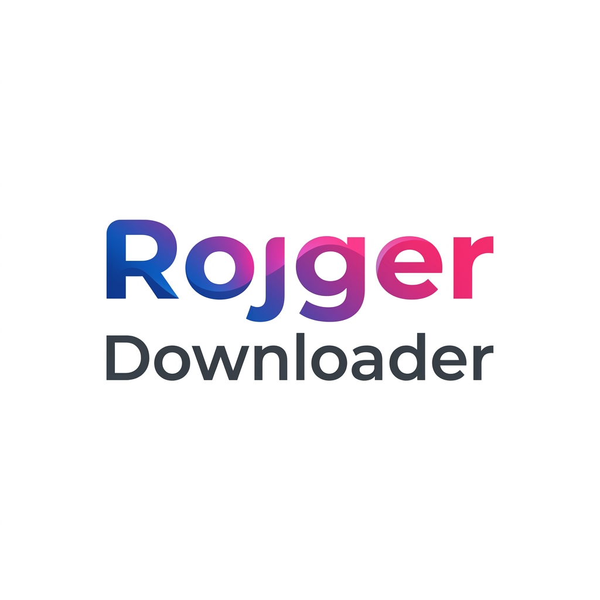

# ROJGER Downloader 🚀

A premium, universal high-speed media acquisition engine. Built for those who demand precision, speed, and zero-loss quality in media curation.



## ✨ Features

- **Universal Platform Support**: Download from YouTube, Instagram, TikTok, Facebook, Twitter, Pinterest, and 1000+ other sites.
- **Premium Liquid UI**: A high-end, minimalist SaaS-inspired interface with Plus Jakarta Sans typography.
- **Zero-Loss Extraction**: High-fidelity media acquisition without quality compromise.
- **Ultra-Fast Engine**: Powered by a robust asynchronous backend for rapid processing.
- **Responsive Design**: Flawless experience across mobile, tablet, and desktop.
- **Minimalist Branding**: Pure typographic identity for a professional software feel.

## 🛠️ Tech Stack

- **Frontend**: HTML5, Vanilla CSS3 (Glassmorphism), JavaScript (ES6+).
- **Styling**: TailwindCSS CDN for rapid utility-based layout.
- **Backend**: FastAPI (Python 3.11+).
- **Processing**: yt-dlp for reliable media extraction.
- **Typography**: Plus Jakarta Sans via Google Fonts.

## 🚀 Getting Started

### Prerequisites

- Python 3.11 or higher
- `uv` or `pip` for dependency management

### Installation

1. Clone the repository:
   ```bash
   git clone https://github.com/satyamsk05/rojgardownloader.git
   cd rojgardownloader
   ```

2. Set up a virtual environment:
   ```bash
   python -m venv .venv
   source .venv/bin/activate  # On Windows use `.venv\Scripts\activate`
   ```

3. Install dependencies:
   ```bash
   pip install -r requirements.txt
   ```

4. Run the application:
   ```bash
   python -m uvicorn web_app.main:app --host 0.0.0.0 --port 8000
   ```

5. Open your browser and navigate to `http://localhost:8000`.

## 📜 License

This project is licensed under the MIT License - see the LICENSE file for details.

---
Built with ⚡ by Antigravity
